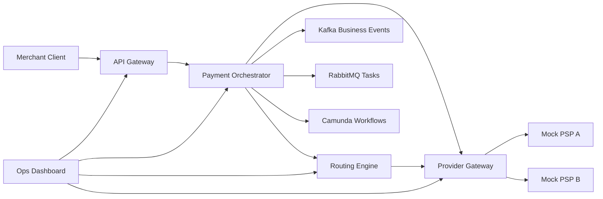

# Domain Map

```mermaid
flowchart LR
    Merchant["Merchant Client"] --> Gateway["API Gateway"]
    Gateway --> Orchestrator["Payment Orchestrator"]
    Orchestrator --> Routing["Routing Engine"]
    Orchestrator --> ProviderGateway["Provider Gateway"]
    Routing --> ProviderGateway
    ProviderGateway --> ProviderA["Mock PSP A"]
    ProviderGateway --> ProviderB["Mock PSP B"]
    Orchestrator --> Events["Kafka Business Events"]
    Orchestrator --> Tasks["RabbitMQ Tasks"]
    Orchestrator --> Workflow["Camunda Workflows"]
    Ops["Ops Dashboard"] --> Gateway
    Ops --> Orchestrator
    Ops --> Routing
    Ops --> ProviderGateway
```

## Primary Entities

- `Payment`
- `Refund`
- `Subscription`
- `Provider`
- `RoutingRule`
- `PaymentAttempt`
- `IdempotencyKey`
- `OutboxMessage`
- `InboxMessage`
- `AuditLog`
