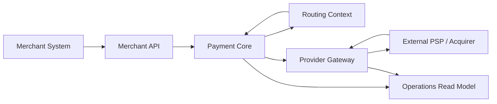

# Module 1: Архитектурная карта PayFlow Hub

## Зачем нужна архитектурная карта

Архитектурная карта показывает общую форму системы до того, как мы погрузимся в код.

Она нужна, чтобы новичок понимал:

- откуда приходит запрос;
- где живёт доменная логика;
- где система общается с внешним миром;
- где появится операционная видимость;
- почему асинхронные механизмы будут добавляться позже, а не сейчас.

## Текущая учебная карта

## Разбор компонентов

### `Merchant API`

Что это такое:
внешняя точка входа для интегратора мерчанта.

Что решает:
стабильный контракт, валидацию запроса, versioning, correlation, idempotency и безопасную публикацию возможностей платформы наружу.

### `Payment Core`

Что это такое:
доменное ядро, которое владеет жизненным циклом платежа.

Что решает:
инварианты, статусы, state transitions, связь между платёжными попытками и бизнес-решениями.

### `Routing Context`

Что это такое:
логика выбора провайдера.

Что решает:
какой PSP лучше подходит для конкретного запроса с точки зрения правил, доступности и политики fallback.

### `Provider Gateway`

Что это такое:
прослойка, которая скрывает неоднородность PSP.

Что решает:
адаптеры протоколов, нормализацию ошибок, трансляцию команд и ответов между нашим языком и языком провайдера.

### `Operations Read Model`

Что это такое:
операционный слой чтения для расследования и наблюдения.

Что решает:
обзор жизненного цикла платежа, route history, provider responses и диагностику аномалий.

## Почему карта именно такая

Мы специально начинаем с формы, которая похожа на `modular monolith with explicit boundaries`, а не на сетку из микросервисов.

Это выбрано сейчас, потому что:

- проще понять причинно-следственные связи;
- проще дебажить локально;
- легче показать эволюцию от простого к production-grade;
- новичок учится архитектуре, а не борьбе с распределённым окружением.

## Trade-offs

Плюсы:

- низкий порог входа;
- хорошая читаемость;
- минимальная инфраструктурная стоимость на старте.

Минусы:

- ещё не показаны реальные изоляционные свойства распределённой системы;
- часть эксплуатационных проблем появится только на следующих этапах;
- границы пока логические, а не сетевые.

## Какие anti-patterns помогает избежать эта карта

- «Сразу микросервисы без предметной модели».
- «Один orchestration service знает всё и обо всём».
- «DTO провайдера становятся внутренним стандартом».
- «Ops появляется в самом конце как случайная админка».

## Что будет дальше

Следующий модуль превратит эту карту в:

- solution structure;
- projects по слоям и контекстам;
- первые contracts;
- build discipline и developer workflow.
